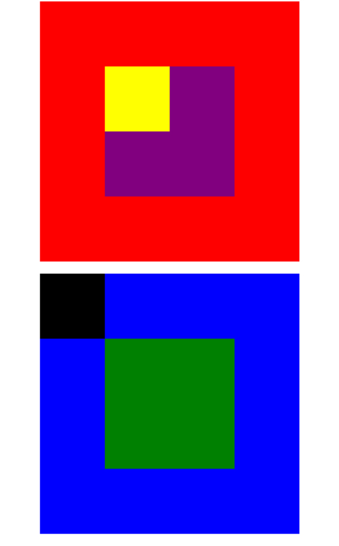

# Posicionando Cajas - segundo ejercicio

## Descripción

Se pide replicar las siguiente imagenes: 

A tener en cuenta:

* Hacer uso de la propiedad position

Links consultados:

[Enlace 1][1], [Enlace 2][2]

 [1]: http://librosweb.es/libro/css/capitulo_5/posicionamiento_absoluto.html
 [2]: http://es.learnlayout.com/position.html
